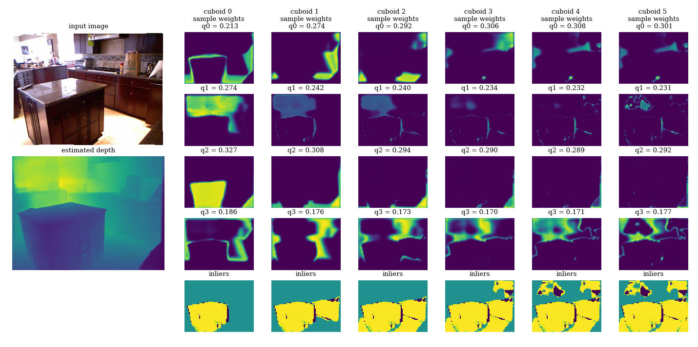
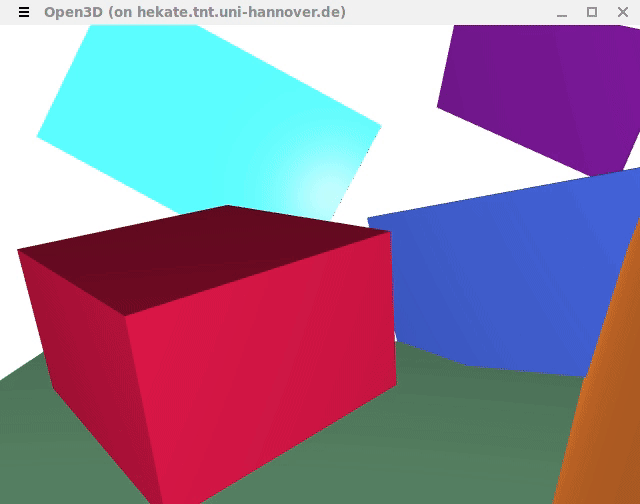

# Cuboids Revisited: Learning Robust 3D Shape Fitting to Single RGB Images

**UPDATE (2024/03/18):**
An extended version of our work has been accepted for publication in Transactions on Pattern Analysis and Machine Intelligence (PAMI):\
[Robust Shape Fitting for 3D Scene Abstraction](https://arxiv.org/abs/2403.10452)\
The correspondingly extended source code will be published here soon.


If you use this code, please cite [our paper](http://arxiv.org/abs/2105.02047):
```
@inproceedings{kluger2021cuboids,
  title={Cuboids Revisited: Learning Robust 3D Shape Fitting to Single RGB Images},
  author={Kluger, Florian and Ackermann, Hanno and Brachmann, Eric and Yang, Michael Ying and Rosenhahn, Bodo},
  booktitle={Proceedings of the IEEE Conference on Computer Vision and Pattern Recognition (CVPR)},
  year={2021}
}
```

For depth estimation, we utilise [BTS](https://github.com/cogaplex-bts/bts). If you do as well, please also cite their paper:
```
@article{lee2019big,
  title={From big to small: Multi-scale local planar guidance for monocular depth estimation},
  author={Lee, Jin Han and Han, Myung-Kyu and Ko, Dong Wook and Suh, Il Hong},
  journal={arXiv preprint arXiv:1907.10326},
  year={2019}
}
```


## Installation
Get the code:
```
git clone --recurse-submodules https://github.com/fkluger/cuboids_revisited.git
cd cuboids_revisited
git submodule update --init --recursive
```

Set up the Python environment using [Anaconda](https://www.anaconda.com/): 
```
conda env create -f environment.yml
source activate cuboids_revisited
```

Install the patched torchgeometry lib:
```
cd util/torchgeometry
python setup.py install
cd ../..
```


## Data
### NYU Depth v2
In order to use the NYU Depth v2 dataset, you need to obtain the original 
[MAT-file](http://horatio.cs.nyu.edu/mit/silberman/nyu_depth_v2/nyu_depth_v2_labeled.mat) and convert it to a 
*version 7* MAT-file in MATLAB so that we can load it via scipy:
```
load('nyu_depth_v2_labeled.mat')
save('nyu_depth_v2_labeled.v7.mat','-v7')
```

Then, extract all images and depth maps to separate Pickle files using our helper script:
```
python util/extract_nyu_to_files.py --source nyu_depth_v2_labeled.v7.mat --destination ./datasets/nyu_depth/files
```

## Pre-trained models
Download our pre-trained models, which we used for the experiments in our paper from 
[here](https://cloud.tnt.uni-hannover.de/index.php/s/IQpHzrxFs2ZJXBE) and place the files in the `models` directory.

If you want to train our method for RGB input, please also obtain the pre-trained weights for the BTS depth estimator 
from [here](https://cogaplex-bts.s3.ap-northeast-2.amazonaws.com/bts_nyu_v2_pytorch_densenet161.zip) and place them in
the `models` folder as well.

## Demo

We provide a demo script which performs cuboid fitting on any user provided RGB image. By default, an example from NYUv2 is used:
```
python demo.py --gpu GPU_ID
```
Two windows should appear. One shows the image, estimated depth, estimated sampling weights, and inlier maps per cuboid:



The second window provides a rendering of the extracted cuboids: 



If you use your own images, you need to provide intrinsic camera parameters: focal length and principal point.
```
python demo.py --image_path PATH --gpu GPU_ID \
-f FOCAL_LENGTH -cx PRINCIPAL_POINT_X -cy PRINCIPAL_POINT_Y
```


## Evaluation
In order to repeat the main experiments from our paper using pre-trained neural networks, you can simply run the following commands:

### Input: ground truth depth
```
python evaluate.py --load ./models/consac_weights.net
```
This will run our method for depth input on the NYU test set with the parameters used in the paper and report all 
evaluation metrics at the end.

### Input: RGB image
```
python evaluate.py --depth_model bts --load ./models/consac_weights.net
```

### Additional options
#### GPU usage
By default, all computations run on the CPU. You can decide which parts of the pipeline shall be executed on which GPU.

Depth estimation (GPU recommended):
```
--depth_gpu GPU_ID
```

Sampling weight estimation:
```
--consac_gpu GPU_ID
```

Cuboid fitting (CPU recommended if you have a lot of cores, GPU will be slower, but your mileage may vary):
```
--consac_gpu GPU_ID
```

Inlier counting:
```
--inlier_gpu GPU_ID
```

If you set `GPUID = -1` (default value), the CPU will be used.

#### Visualisation

Add the option `--visualise` to get a plot of sampling weights and inliers for each image.

## Training
### Depth input
```
python train.py --train_consac --normalise_depth --hyps 32 --consac_gpu GPU_ID --inlier_gpu GPU_ID --fitting_gpu GPU_ID
```
This will only train the sampling weight estimation network for (ground truth) depth input. 

By default, the final network weights will be saved as `./results/train/session_***_gt/consac_weights_best.net`. 

Replace `GPU_ID` with the ID of your GPU, e.g. `0`. 

### RGB input
```
python train.py --depth_model bts --train_depth --bn_on_input --hyps 32 \
--depth_gpu GPU_ID --consac_gpu GPU_ID --inlier_gpu GPU_ID --fitting_gpu GPU_ID \
--load_depth ./models/bts_nyu_v2_pytorch_densenet161/model 
```
This will fine-tune the depth estimation network while using our pre-trained sampling weight estimator. 
You can change the path to the pre-trained weights using the `--load PATH` option.

If you want to fine-tune the sampling weight estimator as well, add `--train_consac`. 

By default, the final network weights of the depth estimator will be saved as `./results/train/session_***_bts/depth_weights_best.net`.

You may want to use a separate GPU for `--depth_gpu`, as the whole pipeline does not fit on a single GPU with 12GB memory. 
